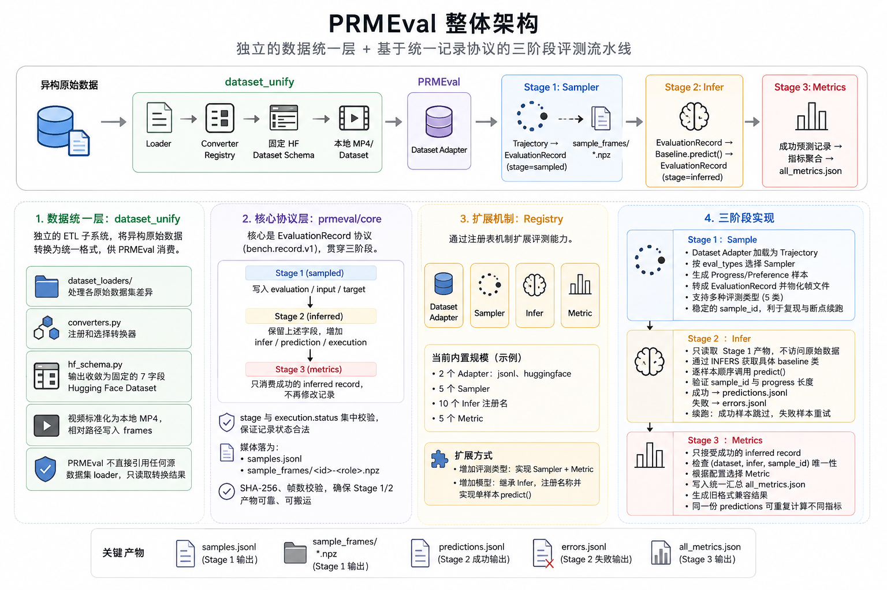

# PRMEval 机器人奖励模型评测框架

PRMEval 是一个面向机器人任务进度与偏好模型的评测框架。它读取本地数据集，构造统一评测样本，通过本地 Hugging Face 模型或远程服务推理，并计算评测指标。



## 核心流程

评测由三个可独立运行和验证的阶段组成：

1. **Sample**：读取数据集、抽帧并生成统一的 `EvaluationRecord`。
2. **Infer**：调用本地或远程模型并保存标准化预测结果。
3. **Metrics**：读取成功的预测记录并计算、聚合指标。

阶段职责和数据流见 [三阶段评测流程](docs/PIPELINE.md)，各文件的用途、内容及断点续跑行为见 [全流程运行产物说明](docs/ARTIFACTS.md)，字段定义见 [EvaluationRecord 数据结构](docs/RECORD_SCHEMA.md)。

## 安装

PRMEval 支持 Python 3.10 及以上版本。

```bash
pip install -e .
```

本地 Hugging Face/Qwen-VL 模型使用可选依赖：

```bash
pip install -e '.[local-hf,local-qwen]'
```

## 快速开始

仓库提供了调用通用远程模型 `progress_test` 的端到端冒烟配置
[`configs/eval/progress_test_remote.yaml`](configs/eval/progress_test_remote.yaml)。运行前设置 OpenAI-compatible
服务信息：

```bash
export OPENAI_API_KEY='your-api-key'
export BASE_URL='https://your-service.example.com/v1'
export MODEL_ID='your-model-id'
```

连续执行采样、推理和指标计算：

```bash
python -m prmeval.cli run --config configs/eval/progress_test_remote.yaml
```

命令行会在交互式终端中使用 `tqdm` 分别展示 Sample、Infer 和 Metrics 三个阶段的进度，并输出阶段开始、完成及断点续跑跳过数量。动态进度写入 stderr，最终 JSON 摘要写入 stdout，因此可以安全地重定向结果：

```bash
python -m prmeval.cli run --config configs/eval/progress_test_remote.yaml > summary.json
```

在 CI、管道等非交互环境中，动态进度条会自动关闭，阶段日志仍会保留。也可以手动关闭动态进度条：

```bash
python -m prmeval.cli run --config configs/eval/progress_test_remote.yaml --no-progress
```

也可以单独运行各阶段：

```bash
python -m prmeval.cli sample --config configs/eval/progress_test_remote.yaml
python -m prmeval.cli infer --config configs/eval/progress_test_remote.yaml
python -m prmeval.cli metrics --config configs/eval/progress_test_remote.yaml
```
查看已注册组件：

```bash
python -m prmeval.cli list-datasets
python -m prmeval.cli list-samplers
python -m prmeval.cli list-infers
python -m prmeval.cli list-metrics
```

完整命令和验证方式见 [三阶段评测流程](docs/PIPELINE.md)，冒烟测试的输入与预期产物见 [完整冒烟测试说明](examples/stage_full_smoke/README.md)。

## 文档

- [配置文件说明](docs/CONFIGURATION.md)
- [Infer 模型接入](docs/INFER_MODELS.md)
- [三阶段评测流程](docs/PIPELINE.md)
- [全流程运行产物说明](docs/ARTIFACTS.md)
- [EvaluationRecord 数据结构](docs/RECORD_SCHEMA.md)
- [本地数据格式与 Dataset Adapter](docs/DATASETS.md)
- [原始数据集统一工具](dataset_unify/README.md)

## 推理代码结构

```text
prmeval/infer/
├── __init__.py          # 导入 built-in baselines 并触发注册
├── base.py              # Infer 抽象类、图片编码与标准 Prediction 构造
├── openai.py            # 组合式 OpenAI-compatible client 与 JSON Schema 校验
└── baselines/
    ├── __init__.py      # 导入所有 built-in baseline
    ├── common.py        # 模型之间确实共用的算法 helper
    ├── progress_test.py
    ├── gvl.py
    ├── roboreward.py
    ├── robodopamine.py
    ├── sole_r1.py
    ├── topreward.py
    ├── vlac.py
    ├── rbm.py           # 同时注册 rbm 和 rewind
    ├── rlvlmf.py        # preference baseline
    └── rbd_inference.py
```

所有 baseline 直接继承 `Infer` 并使用 `@register_infer(name)` 注册。Runner 根据 `config.infer.name` 直接构造具体类，随后顺序逐样本调用 `predict()`。框架不区分 local/remote，也不提供公共 batch 或 adapter 层；运行方式由 baseline 自己决定。

Progress baseline 保留标准 `compute_progress()`，由 `predict()` 统一调用并生成等长、有限、位于 `[0,1]` 的 `ProgressPrediction`。RLVLMF 的 `predict()` 调用 `compute_preference()`。完整接口见 [Infer 模型接入](docs/INFER_MODELS.md)。

`progress_test` 用于检查通用 OpenAI-compatible 协议及三个 Stage 的产物衔接；真实 baseline 的算法正确性仍应使用各模型自己的回归测试验证。

原始数据需要先通过独立的 [`dataset_unify`](dataset_unify/) 工具转换为本地标准 Hugging Face Dataset，再交给 PRMEval 读取。数据统一的字段、配置和新增数据集方法均以该工具自己的文档为准。

## 致谢与来源说明

本项目基于开源项目 [Robometer](https://github.com/robometer/robometer) 进行重构与扩展。

感谢 Robometer 项目的作者和贡献者开源其代码。本仓库中的部分实现来源于 Robometer，并在此基础上进行了代码结构重组、重构以及功能扩展，以适配本项目的具体需求。
